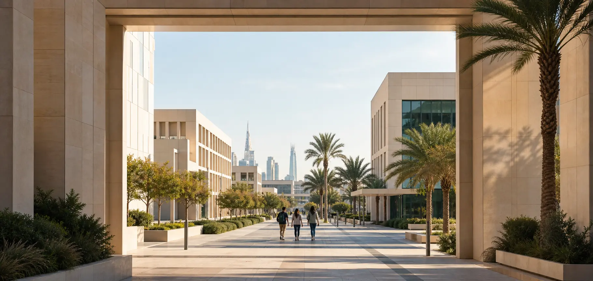

# Saudi Education Expo 2026

Public event hub untuk **Saudi Education Expo 2026 (SEE26)**, kelanjutan agenda tahunan yang pada 2025 dikenal sebagai **Saudi University Expo**.



## Pengalaman Produk

Website dirancang sebagai event hub yang modern, ringkas, ramah, dan berorientasi informasi. Halaman dibuka dengan visual gateway yang sinematik, sementara judul, deskripsi, tanggal, lokasi, dan CTA tetap statis serta mudah dibaca. Setelah itu, antarmuka kembali menjadi halaman event konvensional yang cepat dipindai.

- Hero langsung menampilkan nama event, tanggal, venue, dan CTA tiket.
- Cinematic opening berbasis scroll desktop dengan satu scene 2.5D yang koheren.
- Mobile memakai hero normal-flow dengan gerak minimal.
- Narasi historis dari Saudi University Expo 2025 ke Saudi Education Expo 2026.
- Deskripsi resmi, alasan event, aktivitas, audiens, dan outcome peserta.
- Controlled “Segera diumumkan” states untuk agenda, speaker, institusi, tiket, partner, dan dokumentasi yang belum resmi.
- Venue, FAQ berbasis materi terkonfirmasi, dan sticky CTA mobile.
- Dukungan `prefers-reduced-motion` dengan hero statis dan konten normal-flow.
- Tidak ada angka, nama, jadwal, harga, atau klaim partner yang dibuat untuk mengisi kekosongan konten.

> Penjualan tiket belum dibuka pada UI karena data resmi kategori, harga, benefit, periode, dan kuota belum diberikan. Sistem menampilkan status terkontrol sampai informasi penyelenggara tersedia.

## Design System

Seluruh UI menggunakan **Plus Jakarta Sans**. Green dipakai sebagai warna aksi dan aksen—bukan sebagai latar setiap section.

| Token | Nilai |
| --- | --- |
| Background | `#F5F7F5` |
| Surface | `#FFFFFF` |
| Surface soft | `#EDF5F0` |
| Primary | `#078B4F` |
| Primary dark | `#075436` |
| Green 900 | `#063D28` |
| Primary soft | `#DDF3E6` |
| Text primary | `#101713` |
| Text secondary | `#667069` |
| Border | `#DCE5DF` |
| Gold accent | `#F1B93B` |

Konten menggunakan container terpusat dengan lebar maksimum sekitar `1040px`. Cards memakai radius `16–24px`, border tipis, shadow lembut, dan padding yang efisien. Button memiliki tinggi sentuh minimum `48px`.

## Stack

- [React 18](https://react.dev/)
- [Vite 6](https://vite.dev/)
- CSS custom properties
- Browser-native `IntersectionObserver`, `requestAnimationFrame`, dan media queries

Tidak ada GSAP, Lenis, Three.js, UI framework, atau component library besar.

## Menjalankan Lokal

```bash
git clone https://github.com/hmad28/saudi-expo.git
cd saudi-expo
npm install
npm run dev
```

Production build:

```bash
npm run build
npm run preview
```

## Scripts

| Perintah | Fungsi |
| --- | --- |
| `npm run dev` | Menjalankan Vite development server |
| `npm run build` | Membuat production build |
| `npm run preview` | Menjalankan preview production build |

## Struktur Utama

```text
saudi-expo/
├── public/
│   ├── favicon.svg
│   ├── see26-cinematic-campus.webp
│   ├── see26-cinematic-campus-mobile.webp
│   ├── see26-og.jpg
│   └── ...
├── src/
│   ├── components/
│   │   ├── CinematicHero.jsx
│   │   ├── EventOverview.jsx
│   │   ├── TicketSection.jsx
│   │   ├── Documentation.jsx
│   │   └── ...
│   ├── utils/
│   ├── main.jsx
│   └── styles.css
├── index.html
└── package.json
```

## Catatan Produksi

Sebelum digunakan untuk penjualan publik, sistem masih membutuhkan data resmi dan integrasi:

- validasi harga dan kuota di backend;
- reservasi stok dalam transaksi database;
- payment session dan webhook yang terverifikasi serta idempotent;
- token akses dan check-in yang dibuat secara kriptografis;
- pengiriman dan retry email transaksional;
- autentikasi admin dan role-based access control;
- rate limiting, audit log, monitoring, serta export data;
- konten pembicara, institusi, partner, agenda, tiket, dokumentasi, dan kebijakan yang sudah dikonfirmasi panitia.

---

**Saudi Education Expo 2026**  
31 Juli–2 Agustus 2026 · SMESCO Indonesia, Jakarta
